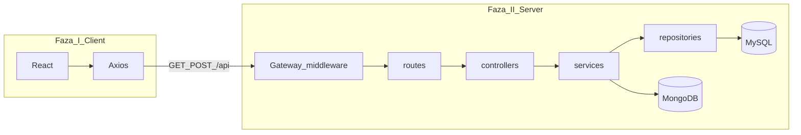

# Car Dealership

Projekti lidh **Fazën I** (teknologjitë dhe integrimi) me **Fazën II** (arkitekturë e shtresuar) pa ndryshuar URL-të publike të API-së — frontend-i vazhdon të përdorë të njëjtat thirrje `axios` te `/api/*`.

## 3. Frameworks & Teknologjitë (përputhje me rubrikën)

| Kërkesë | Si implementohet në këtë projekt |
|--------|-----------------------------------|
| Backend enterprise (një nga: Spring Boot, Django/DRF, **Express.js**) | **Express.js** (Node.js) — `backend/` |
| Frontend (një nga: **React**, Angular, Vue) | **React.js** — `frontend/` |
| Routing dinamik | **React Router** — rrugë si `/cars/:id`, `/login`, etj. |
| State management (Redux / Vuex) | **Redux Toolkit** — `frontend/src/store/` (`authSlice`, `store`) — `token` dhe `user` |
| RabbitMQ / Kafka (mesazhe ndër-shërbim) | **Jo në kod** (monolith me REST). Përshkrim në [backend/integrations/README.md](backend/integrations/README.md) — si do përdoreshin në sistem me shërbime të shumta |
| gRPC (performancë e lartë) | **Jo në kod** (klienti përdor HTTP/JSON). **Përshkrim** i njëjtë si më sipër |

Nuk është e nevojshme të përdoren të gjitha backend-et në listë — zgjedhja është **një** stack; këtu: **Express + React**.

## Stack (Faza I — themeli)

| Shtresa | Teknologji |
|--------|------------|
| Frontend | React, React Router, Axios, **Redux Toolkit** (gjendja e kyçjes: token + user) |
| Backend | Express, JWT, Joi |
| SQL | MySQL (`mysql2`) — përdoruesit dhe veturat |
| NoSQL | MongoDB + Mongoose — kontakt, logje veturash |

- **Frontend**: `frontend/` — `npm start` (proxy te `http://localhost:5000` nëse është konfiguruar).
- **Backend**: rrënja — `npm start` ose `npm run dev` — dëgjon në `PORT` (default **5000**).
- **Klienti API**: [frontend/src/api.js](frontend/src/api.js) — `Authorization: Bearer <token>` për rrugët e mbrojtura.

## Arkitektura (Faza II — shtresa)

Backend-i organizohet kështu (e njëjta kontratë HTTP si më parë):

| Rruga API (e pandryshuar) | Ku shkon në Fazën II |
|---------------------------|----------------------|
| `/api/auth/*` | `routes` → `authController` → `authService` → `userRepository` |
| `/api/cars/*` | `routes` → `carController` → `carService` → `carRepository` (+ logje Mongo) |
| `/api/admin/stats` | `routes` → `adminController` → `adminService` → repos SQL + Mongo |
| `/api/contact`, `/api/car-logs` | routes ekzistuese (contact / logs) |

### API Gateway Light

Në [backend/index.js](backend/index.js):

- `x-request-id`, rate limit in-memory, logging i thirrjeve.

### Service Discovery dhe shëndeti

- Registry: [backend/integrations/serviceRegistry.js](backend/integrations/serviceRegistry.js)
- `GET /health` — registry + uptime
- `GET /ready` — MySQL + MongoDB

### Rrjedhat e refaktoruara eksplicit në MVC të shtresuar

- Auth (`/api/auth`)
- Cars CRUD (`/api/cars`)
- Admin stats (`/api/admin/stats`)

Më shumë: [backend/integrations/README.md](backend/integrations/README.md).

## Si të nisësh (pa prishje)

1. Nis MySQL dhe MongoDB (sipas mjedisit tënd).
2. Konfiguro `backend/.env` (JWT, MySQL, Mongo URI).
3. Nga rrënja: `npm start` (backend).
4. Në `frontend/`: `npm start` (React).

Nëse `REACT_APP_API_URL` nuk është vendosur, CRA proxy (nëse ekziston në `frontend/package.json`) dërgon `/api` te backend-i lokal.

## Çfarë të instalosh për të punuar në projekt (mjedis real)

Këto **nuk** janë RabbitMQ/Kafka — janë mjetet që i duhen **këtij** repo për të ekzekutuar kodin:

| Aplikacion / mjet | Pse |
|-------------------|-----|
| **Node.js** (LTS) | `npm`, backend Express, build i React-it. |
| **Git** | versionim, commit, push në GitHub. |
| **MySQL** | të dhënat relacionale (users, cars). Me **XAMPP** merr edhe MySQL + phpMyAdmin; ose MySQL Community nëse nuk përdor XAMPP. |
| **MongoDB Community Server** (ose MongoDB Atlas në cloud) | kontaktet dhe logjet; pa Mongo, disa pjesë kthejnë bosh ose 503. |
| **Editor** (Cursor / VS Code) | shkrimi i kodit — opsional por praktik. |

Opsionale: **Postman** ose **Thunder Client** për të testuar `GET/POST` te `http://localhost:5000/api/...`.

**Nuk duhet të instalosh** RabbitMQ, Kafka apo kompilator gRPC për të ekzekutuar këtë projekt — ato janë të përmendura vetëm në **përshkrim arkitekture** (shih më poshtë dhe [backend/integrations/README.md](backend/integrations/README.md)).

## Kërkesë akademike: komunikim ndër-shërbim (vetëm përshkrim, jo në kod)

Në një sistem me **shërbime të shumta** (jo në këtë monolith), zakonisht përdoren:

- **RabbitMQ** ose **Apache Kafka** për radha mesazhesh (evente, punë asinkrone).
- **gRPC** për thirrje të shpejta mes shërbimeve me kontratë të fortë (protobuf).

Për këtë repo, **lidhja me kodin** është vetëm në kuptimin e **kontratës**: `serviceRegistry` + `/health` në Express janë **ekuivalenti i lehtë** i “discovery” brenda një aplikacioni; në një sistem të zgjeruar, shërbimet do regjistroheshin te një broker/registry dhe do komunikonin me Kafka/RabbitMQ/gRPC. Përshkrimi i plotë: [backend/integrations/README.md](backend/integrations/README.md).
