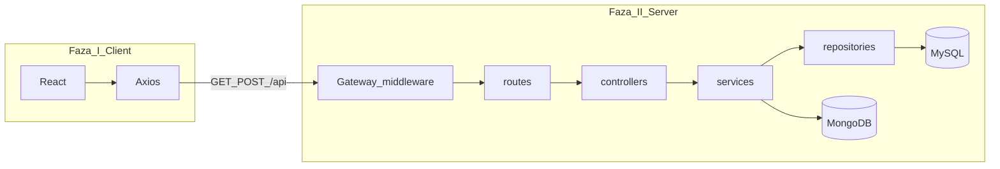

# Car Dealership

Projekti lidh **Fazën I** (teknologjitë dhe integrimi) me **Fazën II** (arkitekturë e shtresuar) pa ndryshuar URL-të publike të API-së — frontend-i vazhdon të përdorë të njëjtat thirrje `axios` te `/api/*`.

## Stack (Faza I — themeli)

| Shtresa | Teknologji |
|--------|------------|
| Frontend | React, React Router, Axios |
| Backend | Express, JWT, Joi |
| SQL | MySQL (`mysql2`) — përdoruesit dhe veturat |
| NoSQL | MongoDB + Mongoose — kontakt, logje veturash |

- **Frontend**: `frontend/` — `npm start` (proxy te `http://localhost:5000` nëse është konfiguruar).
- **Backend**: rrënja — `npm start` ose `npm run dev` — dëgjon në `PORT` (default **5000**).
- **Klienti API**: [frontend/src/api.js](frontend/src/api.js) — `Authorization: Bearer <token>` për rrugët e mbrojtura.

## Arkitektura (Faza II — shtresa)

Backend-i organizohet kështu (e njëjta kontratë HTTP si më parë):

| Rruga API (e pandryshuar) | Ku shkon në Fazën II |
|---------------------------|----------------------|
| `/api/auth/*` | `routes` → `authController` → `authService` → `userRepository` |
| `/api/cars/*` | `routes` → `carController` → `carService` → `carRepository` (+ logje Mongo) |
| `/api/admin/stats` | `routes` → `adminController` → `adminService` → repos SQL + Mongo |
| `/api/contact`, `/api/car-logs` | routes ekzistuese (contact / logs) |

### API Gateway Light

Në [backend/index.js](backend/index.js):

- `x-request-id`, rate limit in-memory, logging i thirrjeve.

### Service Discovery dhe shëndeti

- Registry: [backend/integrations/serviceRegistry.js](backend/integrations/serviceRegistry.js)
- `GET /health` — registry + uptime
- `GET /ready` — MySQL + MongoDB

### Rrjedhat e refaktoruara eksplicit në MVC të shtresuar

- Auth (`/api/auth`)
- Cars CRUD (`/api/cars`)
- Admin stats (`/api/admin/stats`)

Më shumë: [backend/integrations/README.md](backend/integrations/README.md).

## Si të nisësh (pa prishje)

1. Nis MySQL dhe MongoDB (sipas mjedisit tënd).
2. Konfiguro `backend/.env` (JWT, MySQL, Mongo URI).
3. Nga rrënja: `npm start` (backend).
4. Në `frontend/`: `npm start` (React).

Nëse `REACT_APP_API_URL` nuk është vendosur, CRA proxy (nëse ekziston në `frontend/package.json`) dërgon `/api` te backend-i lokal.
