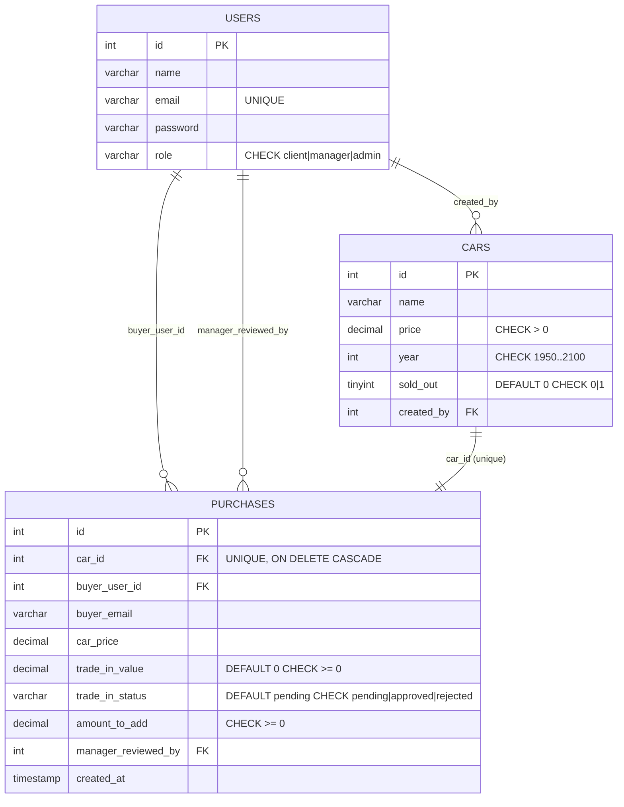

# Database Modeling (Phase 7)

Ky dokument përmbledh modelimin relacional (ERD + constraints + indekse + DB programmability)
dhe modelimin NoSQL (struktura, denormalizimi, shardim/konsistencë).

## 1) Relational ERD (MySQL)

## 2) Constraints & Keys (implemented)

- **UNIQUE**
  - `users.email`
  - `purchases.car_id` (një makinë blihet vetëm një herë)
- **FOREIGN KEYS**
  - `cars.created_by -> users.id` (`ON DELETE SET NULL`)
  - `purchases.car_id -> cars.id` (`ON DELETE CASCADE`)
  - `purchases.buyer_user_id -> users.id` (`ON DELETE SET NULL`)
  - `purchases.manager_reviewed_by -> users.id` (`ON DELETE SET NULL`)
- **CHECK**
  - role i përdoruesit (`client|manager|admin`)
  - validime për çmime, vite, sold_out, trade-in status, amounts
- **DEFAULT**
  - `cars.sold_out = 0`
  - `purchases.trade_in_status = 'pending'`
  - `purchases.trade_in_value = 0`

## 3) Optimized Indexes (implemented)

- `idx_cars_sold_out_year` (`sold_out`, `year`)
- `idx_cars_price` (`price`)
- `idx_purchases_created_at` (`created_at`)
- `idx_purchases_status_created` (`trade_in_status`, `created_at`)
- `idx_purchases_buyer_email` (`buyer_email`)

Këto indekse përmirësojnë:
- listing/filter të makinave (available/sold + year/price),
- manager review queue (`pending` + latest),
- kërkimet operative në purchases.

## 4) Stored Procedure & Triggers (implemented)

- **Stored Procedure**
  - `sp_tradein_review_queue()`
  - kthen listën e trade-ins në pritje (`pending`) për review.

- **Triggers**
  - `trg_purchases_before_insert`
    - normalizon `buyer_email`,
    - llogarit `amount_to_add` nëse mungon/është negativ,
    - vendos `trade_in_status='approved'` kur nuk ka trade-in.
  - `trg_purchases_before_update`
    - nëse trade-in refuzohet, vendos `amount_to_add = car_price`,
    - mban `amount_to_add >= 0`.

## 5) NoSQL Modeling (MongoDB)

### Collections
- `contacts`
  - fusha bazë: `name`, `email`, `message`
  - **embedded entity**: `context` (`carId`, `source`, `tags`)
- `carlogs`
  - event log për audit trail (`action`, `carId`, `userId`, `carName`, timestamps)

### Denormalization strategy
- Ruhet `carName` dhe metadata relevante në logje për lexim/reportim të shpejtë,
  pa JOIN runtime me MySQL.
- `contacts.context` ruan kontekstin e hyrjes (landing/detail/buy_flow), duke
  shmangur lookup shtesë.

### Sharding & consistency strategy (design-level)
- **Sharding key suggestion**
  - `carlogs`: shard by `{ createdAt: 1, carId: 1 }` ose hashed `carId`
  - `contacts`: shard by hashed `email` për shpërndarje uniforme.
- **Consistency**
  - flukset kritike transaksionale mbeten në MySQL (purchases/sold_out),
  - Mongo përdoret për observability/eventing dhe eventual consistency
    (logje/kontakte), me retry-safe writes në service layer.

