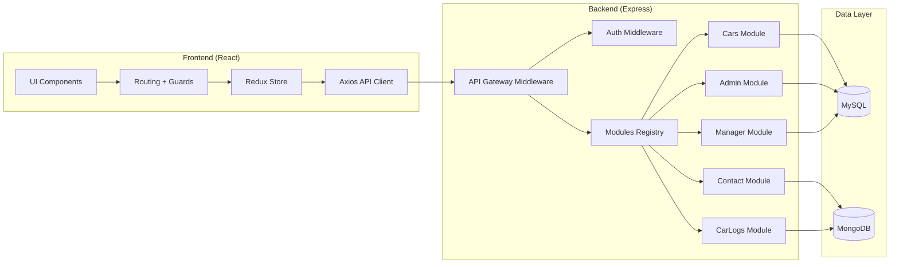
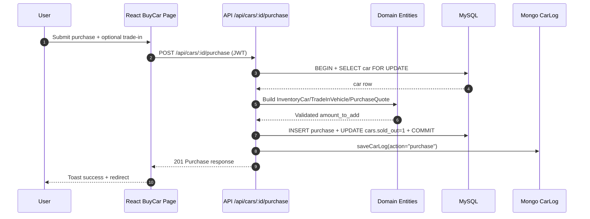
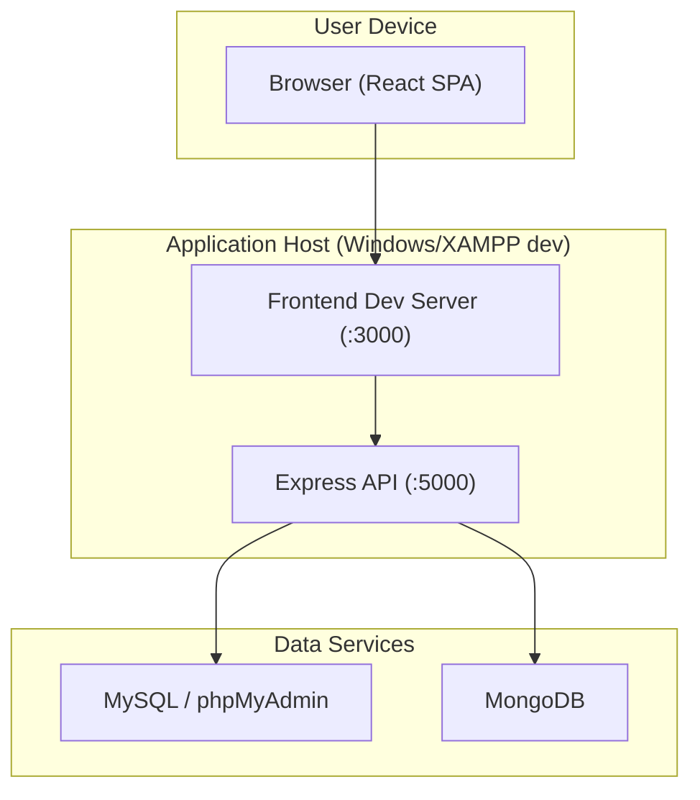
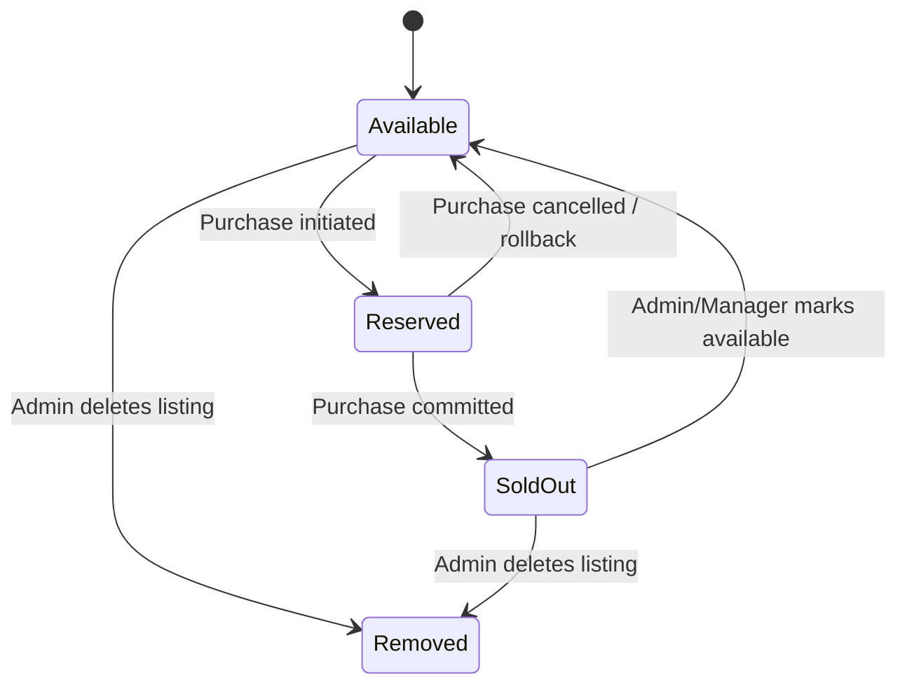

# Supporting Model Diagrams (Phase 8)

Ky dokument përfshin minimalisht 4 diagramat e kërkuara:
- Component Diagram
- Sequence Diagram (API Call)
- Deployment Diagram
- State Diagram (entitet dinamik)

## 1) Component Diagram

## 2) Sequence Diagram (Purchase API Call)

## 3) Deployment Diagram

## 4) State Diagram (Car sales lifecycle)

