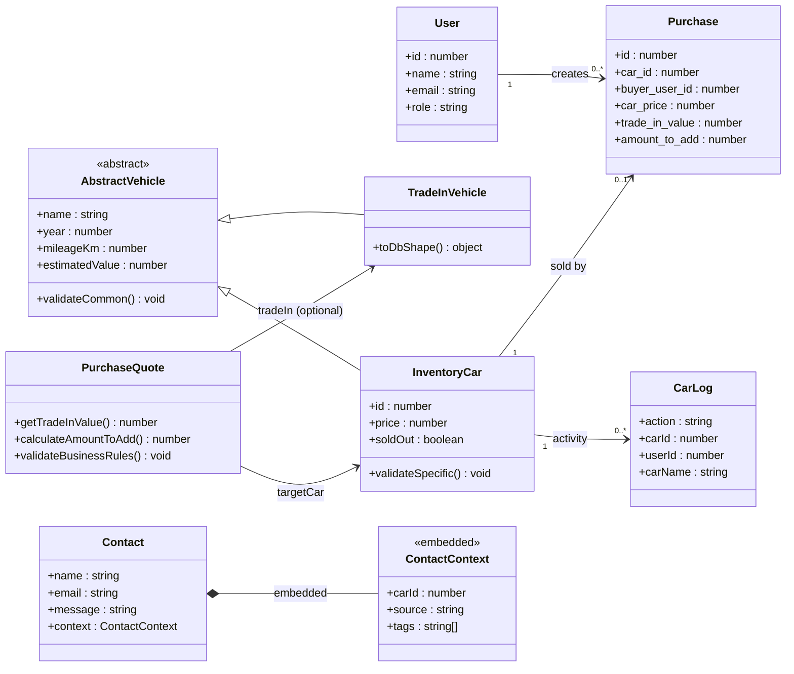

# UML Class Diagram - Entity Modeling (Phase 5)

Ky dokument përmbledh modelimin e avancuar të entiteteve me inheritance, polymorphism,
relacione 1:N / N:N dhe embedded entities.

## Pikat kyçe të modelimit

- **Inheritance/Polymorphism**: `InventoryCar` dhe `TradeInVehicle` trashëgojnë `AbstractVehicle`.
- **Abstract entity**: `AbstractVehicle` nuk instancohet direkt.
- **Relacione 1:N**: `User -> Purchases`, `InventoryCar -> CarLog`.
- **Relacione të kompozuara / embedded (NoSQL)**: `Contact.context` (`ContactContext`) në MongoDB.
- **Validime modeli + biznesi**:
  - Validime strukturore në entitete (`validateCommon`, `validateSpecific`)
  - Validime biznesi në `PurchaseQuote` (`sold_out`, `trade-in` sanity checks)
  - Validime Mongoose për `Contact` dhe enum të zgjeruar për `CarLog.action`.

